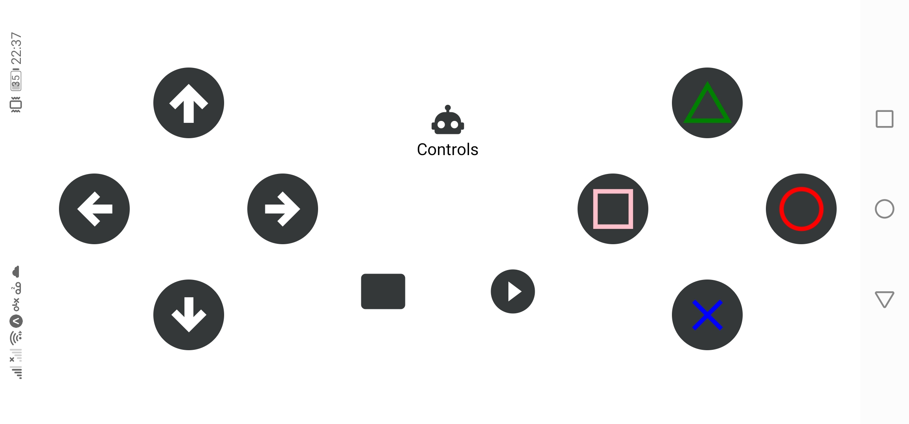
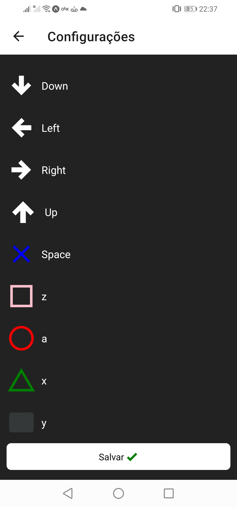

# Projeto controle

 O projeto consiste em um aplicativo mobile de controle remoto para jogar no computador. 
 
 Aplicação mobile desenvolvida em React Native e API desenvolvida em Spring Boot Java.

## Endpoints API

### keyboard
* POST /keyboard/{action}

types action ( 0 = keyPress e keyRelease, 1 = keyPress, 2 = keyRelease

JSON = body:{ hashcode }

## Layout App

  

  

